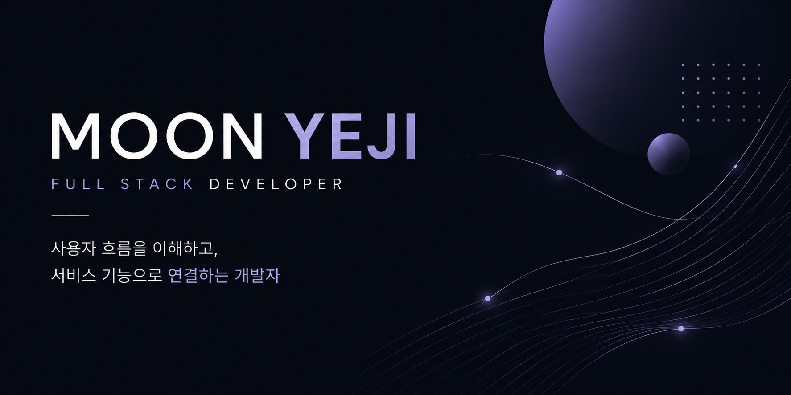
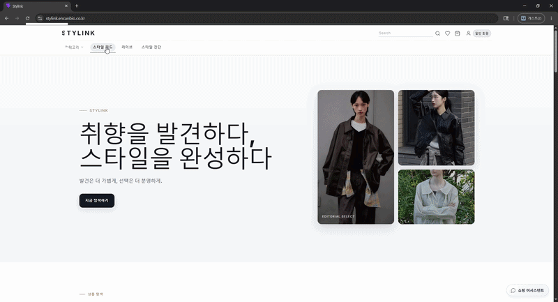
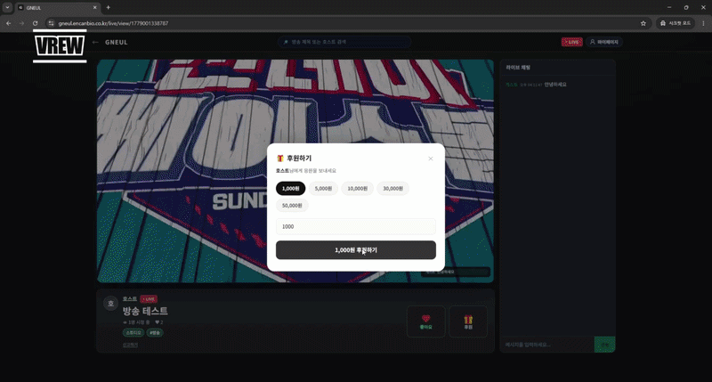

  

 

# 안녕하세요, 신입 풀스택 개발자 문예지입니다 👋

사용자 흐름을 화면과 기능으로 연결하는 개발자를 목표로 하고 있습니다.

사용자가 실제로 서비스를 이용하는 흐름을 기준으로 화면을 설계하고,  
그 행동이 안정적으로 처리될 수 있도록 프론트엔드와 백엔드를 함께 연결하는 데 관심이 있습니다.

Spring Boot와 React를 중심으로 웹 서비스를 개발했으며,  
실시간 라이브 스트리밍, 채팅, 결제, 권한 관리, 커머스 기능을 직접 구현했습니다.

 

## 🧑‍💻 About Me

| 구분 | 내용 |
|---|---|
| 이름 | 문예지 |
| 희망 직무 | 신입 풀스택 개발자 / 웹 개발자 |
| 주요 기술 | Java · Spring Boot · React · MySQL |
| 이메일 | herb6696@gmail.com |

 

## 🛠 Tech Stack

### Backend

 

### Frontend

 

### Database

 

### Realtime / API

 

### Tools / Infra

 

## 💡 What I Value

- 사용자 흐름을 기준으로 화면과 기능을 연결하는 개발
- 단순 기능 구현보다 실제 서비스 경험을 고려한 구조 설계
- 역할 기반 권한과 사용자 상태 흐름에 대한 고민
- 실시간 기능 · 결제 · 커머스 구조에 대한 관심
- UI/UX와 서비스 흐름을 함께 고려하는 개발

 

# 📌 Projects

---

# 👗 Stylink

> AI 기반 패션 커머스 통합 플랫폼  
> B2C 쇼핑 · B2B 도매관 · 피드 · 라이브 커머스 · AI 추천 기능을 하나의 서비스 흐름으로 연결한 개인 프로젝트입니다.

 

## 🔗 Links

| 구분 | 링크 |
|---|---|
| 배포사이트 | https://stylink.encanbio.co.kr |
| 노션 | https://www.notion.so/Portfolio-113b5864179e82ac9f2501056f285196?source=copy_link |
| PPT | https://drive.google.com/file/d/1QNe9MUIYwP69KQfYCklGnVARGt4g3dWn/view?usp=sharing |

 

## 🗓 Project Info

| 항목 | 내용 |
|---|---|
| 프로젝트 유형 | 개인 프로젝트 |
| 개발 기간 | 2026.04 ~ 2026.05 |
| 개발 인원 | 1명 |
| 담당 역할 | 기획 · 프론트엔드 · 백엔드 · DB 설계 · 주요 기능 구현 |
| 주요 기술 | Spring Boot · React · MySQL · JWT · REST API |

 

## 🎬 Preview

> 스타일 피드에서 상품 상세 페이지까지 이어지는 커머스 탐색 흐름

 

## ✨ Main Features

| 기능 | 설명 |
|---|---|
| 사용자 인증 / 역할 관리 | 일반 사용자, 소매 판매자, 도매 판매자, 관리자 역할 기반 접근 제어 |
| 상품 탐색 / 주문 흐름 | 상품 상세, 장바구니, 주문, 결제 완료 흐름 구현 |
| B2B 도매관 | 소매 판매자를 위한 도매 상품 탐색 및 공급 거래 구조 구현 |
| 스타일 피드 | 피드 작성, 조회, 상품 연결 기능 구현 |
| 라이브 커머스 | 라이브 허브, 라이브 시청, 판매자 라이브 스튜디오 구성 |
| AI 스타일 추천 | 취향 · 상황 · 스타일 기반 추천 기능 구현 |
| AI 쇼핑 어시스턴트 | 사용자 질문 기반 상품 탐색 보조 기능 구현 |
| 1:1 다이렉트 채팅 | 사용자와 판매자 간 실시간 문의 흐름 구현 |
| 관리자 기능 | 회원 · 상품 · 주문 · 권한 신청 관리 기능 구성 |

 

## 🙋‍♀️ My Role

- 프로젝트 전체 기획 및 서비스 구조 설계
- React 기반 주요 화면 구현
- Spring Boot 기반 API 구현
- JWT 기반 인증 및 권한 분리 적용
- MySQL 기반 데이터 구조 설계
- 상품 · 주문 · 피드 · 라이브 · 관리자 기능 구현
- 포트폴리오 제출용 UI/UX 개선 및 기능 고도화

 

## 🔍 Troubleshooting

| 문제 | 해결 |
|---|---|
| 역할별 접근 권한 혼동 | 프론트 보호 라우트와 JWT 기반 권한 검증을 함께 적용하여 역할별 접근 흐름 분리 |
| B2C / B2B 콘텐츠 혼재 | 사용자 역할과 공개 상태 기준으로 콘텐츠 노출 범위를 분리 |
| 관리자 기능 범위 불명확 | 운영 중심 관리자 구조로 역할과 UI 흐름 재설계 |

 

---

# 🏠 GNEUL

> 공간대여와 라이브 스트리밍을 결합한 커머스형 플랫폼  
> 실시간 라이브 방송, 채팅, 예약 결제, 권한 승인 흐름을 구현한 팀 프로젝트입니다.

 

## 🔗 Links

| 구분 | 링크 |
|---|---|
| 배포사이트 | https://gneul.encanbio.co.kr |
| 노션 | https://www.notion.so/Portfolio-113b5864179e82ac9f2501056f285196?source=copy_link |
| PPT | https://drive.google.com/file/d/1HjIXcS49GLyqFbyoIdTygiP9uoa54pbY/view?usp=sharing |

 

## 🗓 Project Info

| 항목 | 내용 |
|---|---|
| 프로젝트 유형 | 팀 프로젝트 |
| 개발 기간 | 2026.03 ~ 2026.04 |
| 개발 인원 | 2명 |
| 담당 역할 | 실시간 서비스 · 결제 연동 · 채팅 · 포인트/리워드 · 라이브 기능 |
| 주요 기술 | Spring Boot · React · MySQL · Node.js · Socket.io · WebRTC |

 

## 🎬 Preview

> 실시간 라이브 방송과 채팅, 도네이션 기능이 함께 동작하는 흐름

 

## ✨ Main Features

| 기능 | 설명 |
|---|---|
| 라이브 스트리밍 | 호스트 방송 및 실시간 시청 기능 구현 |
| 실시간 채팅 | 시청자와 호스트 간 실시간 채팅 기능 구현 |
| 라이브 도네이션 | 후원 메시지와 함께 실시간 도네이션 기능 구현 |
| 예약 결제 | 호스트 승인 후 진행되는 예약 결제 흐름 구현 |
| 포인트 / 리워드 | 사용자 등급 기반 적립 및 리워드 구조 설계 |
| 카카오 알림 | 결제 요청 · 예약 확정 · 권한 승인 알림 흐름 구성 |
| HOST ↔ USER 1:1 채팅 | 개별 문의 및 상담 기능 구현 |
| 방송 권한 신청 / 승인 | 관리자 승인 기반 방송 권한 구조 구현 |

 

## 🙋‍♀️ My Role

- WebRTC 기반 라이브 스트리밍 기능 구현
- Socket.io 기반 실시간 채팅 기능 구현
- PortOne 기반 결제 흐름 연동
- 포인트 및 리워드 정책 설계
- 카카오 알림 연동 흐름 구성
- HOST ↔ USER 1:1 채팅 기능 구현
- 방송 권한 신청 및 관리자 승인 흐름 설계
- 라이브 관련 프론트 UI 구현
- 프로젝트 발표 및 PPT 제작

 

## 🔍 Troubleshooting

| 문제 | 해결 |
|---|---|
| 다중 시청자 연결 오류 | signaling 구조를 개선하여 Host ↔ Viewer 연결 흐름 안정화 |
| 실시간 이벤트 충돌 | 라이브 / 1:1 채팅 socket 흐름을 분리하여 이벤트 범위 명확화 |
| 결제 · 포인트 · 알림 순서 문제 | 상태 변경 → 포인트 적립 → 알림 발송 흐름으로 순차 처리 구조 구성 |

 

---

# 📚 Education & Learning

| 분야 | 학습 내용 |
|---|---|
| Java | 객체지향 프로그래밍 · 컬렉션 · 예외 처리 · 쓰레드 |
| Database | Oracle · MySQL · SQL · 관계형 데이터 모델링 |
| Backend | JSP · Servlet · Spring Boot · REST API |
| Frontend | React · 컴포넌트 · State · 이벤트 처리 |
| Realtime | WebRTC · Socket.io · 실시간 통신 구조 |
| Server | Node.js · Express · Router · Middleware |
| Infra | AWS · Docker · 배포 환경 기초 |

 

## 📚 Currently Learning

- Spring Security 기반 인증 / 권한 구조
- WebRTC · Socket.io 실시간 통신 구조
- Docker 기반 배포 환경 구성
- 커머스 서비스 데이터 흐름 설계
- React 기반 사용자 경험 개선

 

## 📈 GitHub Stats

 

## 📫 Contact

- Email : herb6696@gmail.com
- GitHub : https://github.com/herb2194
- Portfolio : https://www.notion.so/Portfolio-113b5864179e82ac9f2501056f285196?source=copy_link

 

---

사용자 흐름을 이해하고,  
그 흐름을 실제 서비스 화면과 기능으로 구현하는 개발자가 되겠습니다.
